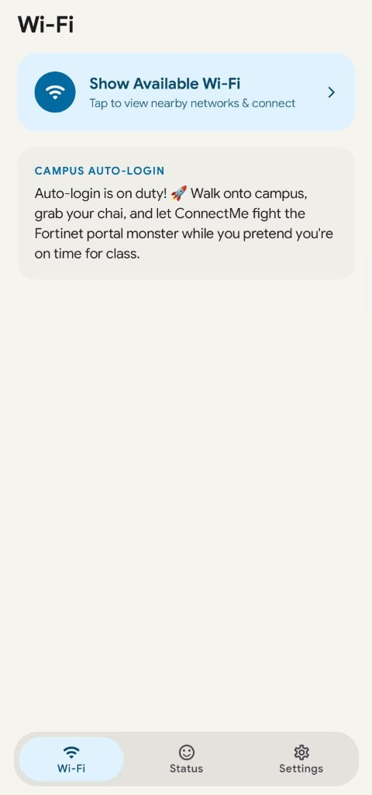
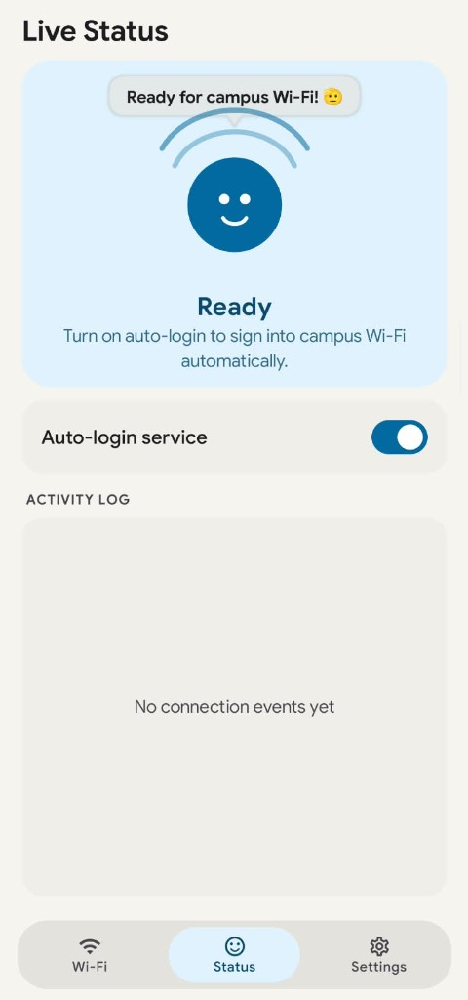
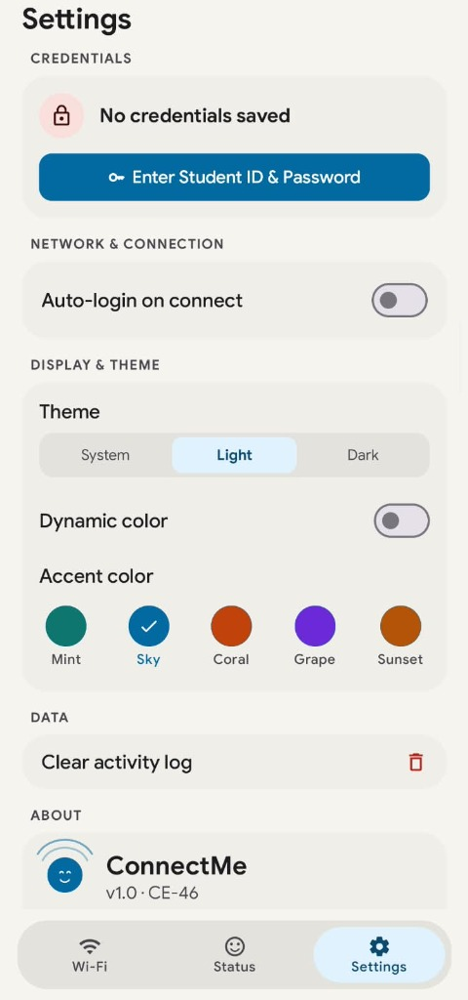

<div align="center">

# ConnectMe 📡

**A fast, private, and lightweight Android companion app built for campus Wi-Fi auto-login from CE-46.**

[](LICENSE)
[](https://kotlinlang.org)
[-3DDC84.svg?logo=android&logoColor=white)](https://developer.android.com)
[](https://developer.android.com/jetpack/compose)
[](ConnectMe-v1.0.0.apk)
[](https://github.com)

<p align="center">
  <a href="#overview">README</a> •
  <a href="CODE_OF_CONDUCT.md">Code of Conduct</a> •
  <a href="CONTRIBUTING.md">Contributing</a> •
  <a href="LICENSE">GPL-3.0 License</a> •
  <a href="SECURITY.md">Security</a>
</p>

</div>

---

## Overview

**ConnectMe** delivers a seamless, zero-tap campus Wi-Fi experience by automating the Fortinet `fgtauth` captive portal login. It eliminates repetitive daily web logins, keeps student credentials locked securely inside hardware-backed **Android Keystore (AES-256-GCM)**, and provides an AOSP-inspired Material 3 interface accompanied by the reactive mascot **"Cee"**.

> [!IMPORTANT]
> **Campus Utility Notice**: ConnectMe is completely free, open-source, and ad-free. It executes all portal handshakes locally directly over your Wi-Fi interface and never collects, tracks, or uploads credentials to external servers.

---

## Table of Contents

- [Overview](#overview)
- [Screenshots](#screenshots)
- [Distinctive Features Under the Hood](#distinctive-features-under-the-hood)
- [Features](#features)
- [Installation & Setup](#installation--setup)
  - [Android Installation](#android-installation)
  - [Building from Source](#building-from-source)
- [Support the Project (☕ Buy Chai)](#support-the-project--buy-chai)
- [Contributors](#contributors)
- [Special Thanks](#special-thanks)

---

## Screenshots

<div align="center">

| Wi-Fi Panel | Live Status & Mascot "Cee" | Settings & Theme Customization |
| :---: | :---: | :---: |
|  |  |  |

</div>

---

## Distinctive Features Under the Hood

- **Sub-Second Fortinet Authentication**: Parses the `fgtauth` challenge token on the fly and posts encrypted authentication payloads in a single network round-trip.
- **Network Interface Isolation**: Prevents DNS poisoning or routing interference on dual-SIM / Wi-Fi connected devices.
- **Native Quick Settings Tile**: Direct access to toggle auto-login or view connection status directly from the Android Quick Settings shade.
- **Ultra-Small Apk**: Just **2.59 MB** 
---

## Features

### ⚡ Seamless Auto-Login
- **Instant Portal Bypass**: Detects captive portals the moment your device connects to campus Wi-Fi and logs in without opening a browser.
- **Background Watcher**: Monitors network state transitions in real time with minimal battery impact.
- **Native System Wi-Fi Panel**: One-tap access to Android's native Wi-Fi bottom sheet without requiring intrusive location permissions.

### 🛡️ Ironclad Security & Privacy
- **Hardware-Backed AES-256-GCM**: Credentials never leave Android Keystore hardware.
- **Zero Telemetry**: No third-party analytics, no tracking libraries, and no external crash reporters.
- **Excluded from Cloud Backups**: Device transfer and cloud backup rules actively protect your student credentials.

### 🎨 Pixel-Grade Customization
- **Google Sans Font**: Clean, readable Google typography applied globally.
- **Curated Color Palettes**: Choose between Mint, Sky, Coral, Grape, or Sunset accent styles.
- **Dynamic Color**: Matches your wallpaper colors on Android 12+ devices.
- **Monospace Activity Log**: Live timestamped portal connection diagnostics with a single-tap clear button.

---

## Installation & Setup

### Android Installation

1. Download the latest pre-compiled release APK from the root of this repository or from the [Releases Page](https://github.com):
   - **File**: `ConnectMe-v1.0.0.apk` (**2.59 MB**)
2. Open the downloaded file on your Android device and install (allow *"Install unknown apps"* if prompted).
3. Open **ConnectMe**, navigate to **Settings**, and save your Student ID and Password.
4. Turn on **Auto-login**, and you are all set!

---

### Building from Source

#### Prerequisites
- **JDK 17** (Temurin / OpenJDK 17 recommended)
- **Android SDK 35** with Build Tools `35.0.0`
- **Git**

#### Steps

1. **Clone the Repository**:
   ```bash
   git clone https://github.com/<your-username>/ConnectMe.git
   cd ConnectMe
   ```

2. **Configure Android SDK**:
   Create a `local.properties` file in the root directory:
   ```properties
   sdk.dir=C:\\Users\\<YourUsername>\\AppData\\Local\\Android\\Sdk
   ```
   *(Or `/home/<user>/Android/Sdk` on Linux / macOS)*

3. **Build the Shrunk Release APK**:
   ```bash
   # On Windows:
   gradlew.bat assembleRelease

   # On Linux / macOS:
   chmod +x gradlew
   ./gradlew assembleRelease
   ```

4. The optimized release APK will be located at:
   ```
   app/build/outputs/apk/release/app-release.apk
   ```

---

## Support the Project (☕ Buy Chai)

If ConnectMe has saved you from typing your portal credentials every morning, consider supporting the developer with a cup of chai!

<div align="center">


**Easypaisa**

> *"Chai fuels the code that defeats the Fortinet portal monster ☕. Scan with Easypaisa or any banking app!"*

</div>

---

## Contributors

Thank you to everyone in the campus community who tested, reported feedback, and contributed to making ConnectMe a smooth daily driver!

---

## Special Thanks

ConnectMe stands on the shoulders of great open-source tools and One Guy Idea. Special appreciation to:

| Contributor / Project | Contribution / Reference |
| :--- | :--- |
| [**Rehan Saqib**](https://github.com/HopzAlot) | Special thanks for guidance, architectural insights, and continuous support |
| [**Android Open Source Project (AOSP)**](https://source.android.com/) | Material 3 specifications, Quick Settings Tile APIs, and System UI patterns |

---

